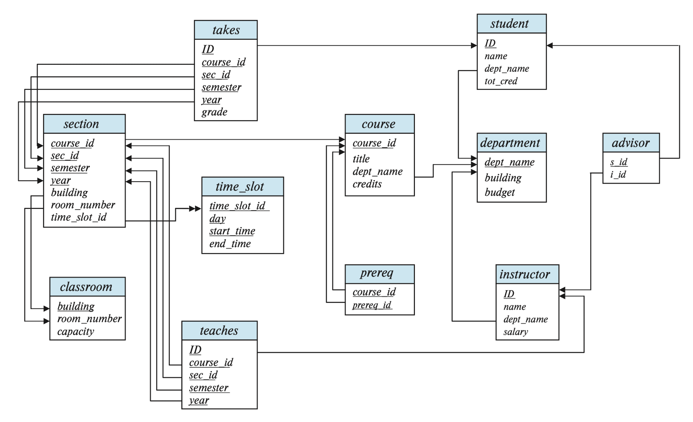

## 关系型数据库结构

**关系模式 Relation Schema**：属性的集合，用 $R = (A_1, A_2, \cdots, A_n)$ 表示，其中 $A_1, A_2, \cdots, A_n$ 称作属性（Attribute）.

 - *e.g.* 设 $\text{instructor} = (\text{ID}, \text{name}, \text{dept\_name}, \text{salary})$，其中 instructor 为关系模式，ID、name、dept_name、salary 为属性.

**超键 Superkey**：设 $R$ 为一个关系模式，$K\subseteq R$，若对于关系 $r(R)$ 中的任意元组 $t$，都有 $t[K]$ 唯一，则称 $K$ 为 $R$ 的超键.

 - *e.g.* $\set{\text{ID}}$ 是 instructor 的超键，$\set{\text{ID}, \text{name}}$ 也是超键.

**候选键 Candidate Key**：若 $K$ 是 $R$ 的超键，且 $K$ 的任意真子集都不是 $R$ 的超键，则称 $K$ 为 $R$ 的候选键.

 - *e.g.* $\set{\text{ID}}$ 是候选键但 $\set{\text{ID}, \text{name}}$ 不是.

**主键 Primary Key**：候选键中选择一个作为主键.

**外键 Foreign Key**：类似于指针，指向另一个关系的主键. 

- **参照完整性 Referential Integrity**：出现在外键中的值必须在被引用的关系中存在.

---

## 教材使用的数据库结构

其中下划线代表主键.

::fold{expand info title="大学数据库结构"}
classroom([building]{.und}, [room_number]{.und}, capacity)\
department([dept_name]{.und}, building, budget)\
course([course_id]{.und}, title, dept_name, credits)\
instructor([ID]{.und}, name, dept_name, salary)\
section([course_id]{.und}, [sec_id]{.und}, [semester]{.und}, [year]{.und}, building, room_number, time_slot_id)\
teaches([ID]{.und}, [course_id]{.und}, [sec_id]{.und}, [semester]{.und}, [year]{.und})\
student([ID]{.und}, name, dept_name, tot_credit)\
takes([ID]{.und}, [course_id]{.und}, [sec_id]{.und}, [semester]{.und}, [year]{.und}, grade)\
advisor([s_ID]{.und}, [i_ID]{.und})\
time_slot([time_slot_id]{.und}, [day]{.und}, [start_time]{.und}, end_time)\
prereq([course_id]{.und}, [prereq_id]{.und})
::

可以据此画出**关系图**（Schema Diagram），其中单箭头表示外键约束，双箭头表示参照完整性约束. *e.g.* 一个 section 可以通过 time_slot_id 对应多个上课时间段，是一对多的关系，且满足参照完整性要求，但 time_slot_id 并不是 time_slot 的主键，因此不是外键.

{.inv}

---

## 基本关系代数

有六种基本操作：选择 $\sigma$、投影 $\Pi$、并 $\cup$、差 $-$、笛卡尔积 $\times$、重命名 $\rho$.

**选择 $\sigma_p(r)$**：选择关系 $r$ 中满足谓词 $p$ 的元组.

 - *e.g.* $\sigma_{\text{dept\_name} = \text{``Physics''}}(\text{instructor})$ 选择出所有系名为 Physics 的教师.
 - *e.g.* $\sigma_{\text{dept\_name} = \text{``Physics''}\ \land\ \text{salary} > 90000}(\text{instructor})$ 选择出系名为 Physics 且工资大于 90000 的教师.

**投影 $\Pi_{A_1, A_2, \cdots, A_n}(r)$**：截取关系 $r$ 中的部分属性 $A_1, A_2, \cdots, A_n$.

::grid{gap=5px align=top}
:sep{span=7 offset=2}
```typst
#show table.cell.where(y: 0): math.bold
#table(
    columns: 3,
    inset: 9pt,
    align: horizon + center,
    stroke: (right: 1pt, bottom: 0pt),
    table.hline(y: 0, stroke: 1pt),
    table.hline(y: 1, stroke: 1pt),
    table.vline(x: 0, stroke: 0pt),
    table.vline(x: 3, stroke: 0pt),
    table.header($A$, $B$, $C$),
    $alpha$, $10$, $1$,
    $alpha$, $20$, $1$,
    $beta$, $30$, $1$,
    $beta$, $40$, $2$
)
```

:sep{span=2 .center}
$\xRightarrow{\displaystyle\Pi_{A, C}(r)}$

:v{2rem}

:sep{span=4 offset=1}
```typst
#show table.cell.where(y: 0): math.bold
#table(
    columns: 2,
    inset: 9pt,
    align: horizon + center,
    stroke: (right: 1pt, bottom: 0pt),
    table.hline(y: 0, stroke: 1pt),
    table.hline(y: 1, stroke: 1pt),
    table.vline(x: 0, stroke: 0pt),
    table.vline(x: 2, stroke: 0pt),
    table.header($A$, $C$),
    $alpha$, $1$,
    $alpha$, $1$,
    $beta$, $1$,
    $beta$, $2$
)
```

:sep{span=1 .center}
$=$

:v{2rem}

:sep{span=4}
```typst
#show table.cell.where(y: 0): math.bold
#table(
    columns: 2,
    inset: 9pt,
    align: horizon + center,
    stroke: (right: 1pt, bottom: 0pt),
    table.hline(y: 0, stroke: 1pt),
    table.hline(y: 1, stroke: 1pt),
    table.vline(x: 0, stroke: 0pt),
    table.vline(x: 2, stroke: 0pt),
    table.header($A$, $C$),
    $alpha$, $1$,
    $beta$, $1$,
    $beta$, $2$
)
```
::

**并 $r\cup s$** $=\set{t\mid t\in r\ \text{或}\ t\in s}$，将两个关系的元组合并，要求两个关系的**元数**（Arity，属性个数）相同，且对应位置的**域**（Domain，所有能填入的值的集合）匹配.

 - *e.g.* 找出所有在 2009 年秋季和 2010 年春季开设的课程：

:v{-0.5em}
   $$
   \begin{align*}
   &\Pi_{\text{course\_id}}(\sigma_{\text{semester} = \text{``Fall''}\ \land\ \text{year} = 2009}(\text{section}))\\
   \cup\ &\Pi_{\text{course\_id}}(\sigma_{\text{semester} = \text{``Spring''}\ \land\ \text{year} = 2010}(\text{section}))
   \end{align*}
   $$

**差 $r-s$** $=\set{t\mid t\in r\ \text{且}\ t\notin s}$，将 $r$ 中存在于 $s$ 中的元组去掉，其要求和 $\cup$ 相同.

**笛卡尔积 $r\times s$** $=\set{t\cup q\mid t\in r\ \text{且}\ q\in s}$，将两个关系的元组两两组合，要求两个关系的**属性不同**，否则必须重命名.

::grid{gap=5px align=top}
:sep{span=5 offset=1}
```typst 关系 $r$
#show table.cell.where(y: 0): math.bold
#table(
    columns: 2,
    inset: 9pt,
    align: horizon + center,
    stroke: (right: 1pt, bottom: 0pt),
    table.hline(y: 0, stroke: 1pt),
    table.hline(y: 1, stroke: 1pt),
    table.vline(x: 0, stroke: 0pt),
    table.vline(x: 2, stroke: 0pt),
    table.header($A$, $B$),
    $alpha$, $1$,
    $beta$, $2$
)
```

:sep{span=5}
```typst 关系 $s$
#show table.cell.where(y: 0): math.bold
#table(
    columns: 3,
    inset: 9pt,
    align: horizon + center,
    stroke: (right: 1pt, bottom: 0pt),
    table.hline(y: 0, stroke: 1pt),
    table.hline(y: 1, stroke: 1pt),
    table.vline(x: 0, stroke: 0pt),
    table.vline(x: 3, stroke: 0pt),
    table.header($C$, $D$, $E$),
    $alpha$, $10$, $a$,
    $beta$, $10$, $a$,
    $beta$, $20$, $b$,
    $gamma$, $10$, $b$
)
```

:sep{span=4 .center}
$\xRightarrow{\displaystyle{r\times s}}$

:v{10rem}

:sep{span=8}
```typst 笛卡尔积 $r\times s$
#show table.cell.where(y: 0): math.bold
#table(
    columns: 5,
    inset: 9pt,
    align: horizon + center,
    stroke: (right: 1pt, bottom: 0pt),
    table.hline(y: 0, stroke: 1pt),
    table.hline(y: 1, stroke: 1pt),
    table.vline(x: 0, stroke: 0pt),
    table.vline(x: 5, stroke: 0pt),
    table.header($A$, $B$, $C$, $D$, $E$),
    $alpha$, $1$, $alpha$, $10$, $a$,
    $alpha$, $1$, $beta$, $10$, $a$,
    $alpha$, $1$, $beta$, $20$, $b$,
    $alpha$, $1$, $gamma$, $10$, $b$,
    $beta$, $2$, $alpha$, $10$, $a$,
    $beta$, $2$, $beta$, $10$, $a$,
    $beta$, $2$, $beta$, $20$, $b$,
    $beta$, $2$, $gamma$, $10$, $b$
)
```
::

**重命名 $\rho_{x}(s)$**：将关系 $s$ 重命名为 $x$.

---

*e.g.* 找出大学中最高的工资：

$$
\begin{align*}
&\Pi_{\text{salary}}(\text{instructor}) - \Pi_{\text{instructor.salary}}\\
&(\sigma_{\text{instructor.salary }<\text{ d.salary}}(\text{instructor}\times\rho_{\text{d}}(\text{instructor})))
\end{align*}
$$

也即，找出所有工资小于某个工资的教师，然后从所有教师中减去这些教师.

---

## 关系代数的扩展

这些拓展**并没有增强关系代数的表达能力**，都能用基本关系代数表示，只是为了方便书写：交 $\cap$、自然连接 ⋈、外连接 ⟕ ⟖ ⟗、半连接 ⋉ ⋊、赋值 $\leftarrow$、除 $\div$.

**交 $r\cap s$** $=\set{t\mid t\in r\ \text{且}\ t\in s}$，顾名思义.

 - $r\cap s = r - (r - s)$.

**自然连接 $r$ ⋈ $s$**：选择两个关系当中相同属性对应的值全部相同的元组，然后将这些元组合并.

 - 设 $R=(A, B, C, D)$，$S=(E, B, D)$，则 $R$ ⋈ $S$ 的关系模式为 $(A, B, C, D, E)$，值为 $\Pi_{r.A,\ r.B,\ r.C,\ r.D,\ s.E}(\sigma_{r.B\ =\ s.B\ \land\ r.D\ =\ s.D}(r\times s))$.
 - 自然连接满足**交换律**和**结合律**.
 - **Theta 连接 $r$ ⋈$_\theta\ s$** $=\sigma_\theta(r\times s)$，为自然连接的一般形式.

**外连接 Outer join**：在连接的过程中避免任何信息的损失，分为左外连接 ⟕、右外连接 ⟖、全外连接 ⟗.

 - **左外连接 $r$ ⟕ $s$**：$r$ 中的元组都会被保留，$s$ 中没有对应的元组用 null 填充.
   - $r$ ⟕ $s = (r$ ⋈ $s) \cup ((r - \Pi_R(r$ ⋈ $s)) \times \set{(\text{null}, \cdots, \text{null})})$.
 - **右外连接 $r$ ⟖ $s$**：$s$ 中的元组都会被保留，$r$ 中没有对应的元组用 null 填充.
   - $r$ ⟖ $s = (r$ ⋈ $s) \cup (\set{(\text{null}, \cdots, \text{null})} \times (s - \Pi_S(r$ ⋈ $s)))$.
 - **全外连接 $r$ ⟗ $s$**：左右外连接的并集.
   - $r$ ⟗ $s = (r$ ⟕ $s) \cup (r$ ⟖ $s)$.


::fold{expand info title="自然连接、外连接例子"}
:::grid{gap=5px align=top}
:sep{span=12}
```typst 关系 instructor
#show table.cell.where(y: 0): set text(weight: "bold")
#show table.cell.where(y: 3): set text(fill: red)
#table(
    columns: 3,
    inset: 9pt,
    align: horizon + center,
    stroke: (right: 1pt, bottom: 0pt),
    table.hline(y: 0, stroke: 1pt),
    table.hline(y: 1, stroke: 1pt),
    table.vline(x: 0, stroke: 0pt),
    table.vline(x: 3, stroke: 0pt),
    table.header([ID], [name], [dept_name]),
    "10101", "Srinivasan", "Comp. Sci.",
    "12121", "Wu", "Finance",
    "15151", "Mozart", "Music"
)
```

:sep{span=12}
```typst 关系 teaches
#show table.cell.where(y: 0): set text(weight: "bold")
#show table.cell.where(y: 3): set text(fill: blue)
#table(
    columns: 2,
    inset: 9pt,
    align: horizon + center,
    stroke: (right: 1pt, bottom: 0pt),
    table.hline(y: 0, stroke: 1pt),
    table.hline(y: 1, stroke: 1pt),
    table.vline(x: 0, stroke: 0pt),
    table.vline(x: 2, stroke: 0pt),
    table.header([ID], [course_id]),
    "10101", "CS-101",
    "12121", "FIN-201",
    "76766", "BIO-101"
)
```
:::

```typst 自然连接 instructor ⋈ teaches
#show table.cell.where(y: 0): set text(weight: "bold")
#table(
    columns: 4,
    inset: 9pt,
    align: horizon + center,
    stroke: (right: 1pt, bottom: 0pt),
    table.hline(y: 0, stroke: 1pt),
    table.hline(y: 1, stroke: 1pt),
    table.vline(x: 0, stroke: 0pt),
    table.vline(x: 4, stroke: 0pt),
    table.header([ID], [name], [dept_name], [course_id]),
    "10101", "Srinivasan", "Comp. Sci.", "CS-101",
    "12121", "Wu", "Finance", "FIN-201"
)
```

```typst 左外连接 instructor ⟕ teaches
#show table.cell.where(y: 0): set text(weight: "bold")
#show table.cell.where(y: 3): set text(fill: red)
#table(
    columns: 4,
    inset: 9pt,
    align: horizon + center,
    stroke: (right: 1pt, bottom: 0pt),
    table.hline(y: 0, stroke: 1pt),
    table.hline(y: 1, stroke: 1pt),
    table.vline(x: 0, stroke: 0pt),
    table.vline(x: 4, stroke: 0pt),
    table.header([ID], [name], [dept_name], [course_id]),
    "10101", "Srinivasan", "Comp. Sci.", "CS-101",
    "12121", "Wu", "Finance", "FIN-201",
    "15151", "Mozart", "Music", "null"
)
```

```typst 右外连接 instructor ⟖ teaches
#show table.cell.where(y: 0): set text(weight: "bold")
#show table.cell.where(y: 3): set text(fill: blue)
#table(
    columns: 4,
    inset: 9pt,
    align: horizon + center,
    stroke: (right: 1pt, bottom: 0pt),
    table.hline(y: 0, stroke: 1pt),
    table.hline(y: 1, stroke: 1pt),
    table.vline(x: 0, stroke: 0pt),
    table.vline(x: 4, stroke: 0pt),
    table.header([ID], [name], [dept_name], [course_id]),
    "10101", "Srinivasan", "Comp. Sci.", "CS-101",
    "12121", "Wu", "Finance", "FIN-201",
    "76766", "null", "null", "BIO-101"
)
```

```typst 全外连接 instructor ⟗ teaches
#show table.cell.where(y: 0): set text(weight: "bold")
#show table.cell.where(y: 3): set text(fill: red)
#show table.cell.where(y: 4): set text(fill: blue)
#table(
    columns: 4,
    inset: 9pt,
    align: horizon + center,
    stroke: (right: 1pt, bottom: 0pt),
    table.hline(y: 0, stroke: 1pt),
    table.hline(y: 1, stroke: 1pt),
    table.vline(x: 0, stroke: 0pt),
    table.vline(x: 4, stroke: 0pt),
    table.header([ID], [name], [dept_name], [course_id]),
    "10101", "Srinivasan", "Comp. Sci.", "CS-101",
    "12121", "Wu", "Finance", "FIN-201",
    "15151", "Mozart", "Music", "null",
    "76766", "null", "null", "BIO-101"
)
```
::

**半连接 Semijoin**：分为左半连接 ⋉ 和右半连接 ⋊.

 - **左半连接 $r$ ⋉$_\theta\ s$** 是 $r$ 的子集，包含了 $r$ 中所有和 $s$ 中至少一个元组有 $\theta$ 关系的元组.
   - $r$ ⋉$_\theta\ s = \Pi_R(r$ ⋈$_\theta\ s)$.
 - **右半连接 $r$ ⋊$_\theta\ s$** 是 $s$ 的子集，包含了 $s$ 中所有和 $r$ 中至少一个元组有 $\theta$ 关系的元组.
   - $r$ ⋊$_\theta\ s = \Pi_S(r$ ⋈$_\theta\ s)$.

::fold{expand info title="半连接例子"}
:::grid{gap=5px}
:sep{span=12}
```typst 关系 $r$
#show table.cell.where(y: 0): math.bold
#table(
    columns: 4,
    inset: 9pt,
    align: horizon + center,
    stroke: (right: 1pt, bottom: 0pt),
    table.hline(y: 0, stroke: 1pt),
    table.hline(y: 1, stroke: 1pt),
    table.vline(x: 0, stroke: 0pt),
    table.vline(x: 4, stroke: 0pt),
    table.header($A$, $B$, $C$, $D$),
    $α$, $1$, $α$, $a$,
    $β$, $2$, $γ$, $a$,
    $γ$, $4$, $β$, $b$,
    $α$, $1$, $γ$, $a$,
    $δ$, $2$, $β$, $b$
)
```

:sep{span=12}
```typst 关系 $s$
#show table.cell.where(y: 0): math.bold
#table(
    columns: 3,
    inset: 9pt,
    align: horizon + center,
    stroke: (right: 1pt, bottom: 0pt),
    table.hline(y: 0, stroke: 1pt),
    table.hline(y: 1, stroke: 1pt),
    table.vline(x: 0, stroke: 0pt),
    table.vline(x: 3, stroke: 0pt),
    $B$, $D$, $E$,
    $1$, $a$, $α$,
    $3$, $a$, $β$,
    $1$, $a$, $γ$,
    $2$, $b$, $δ$,
    $3$, $b$, $ε$
)
```

:sep{span=12}
```typst 左半连接 $r$ ⋉ $s$
#show table.cell.where(y: 0): math.bold
#table(
    columns: 4,
    inset: 9pt,
    align: horizon + center,
    stroke: (right: 1pt, bottom: 0pt),
    table.hline(y: 0, stroke: 1pt),
    table.hline(y: 1, stroke: 1pt),
    table.vline(x: 0, stroke: 0pt),
    table.vline(x: 4, stroke: 0pt),
    $A$, $B$, $C$, $D$,
    $α$, $1$, $α$, $a$,
    $β$, $2$, $γ$, $a$,
    $α$, $1$, $γ$, $a$,
    $δ$, $2$, $β$, $b$
)
```

:sep{span=12}
```typst 右半连接 $r$ ⋊ $s$
#show table.cell.where(y: 0): math.bold
#table(
    columns: 3,
    inset: 9pt,
    align: horizon + center,
    stroke: (right: 1pt, bottom: 0pt),
    table.hline(y: 0, stroke: 1pt),
    table.hline(y: 1, stroke: 1pt),
    table.vline(x: 0, stroke: 0pt),
    table.vline(x: 3, stroke: 0pt),
    $B$, $D$, $E$,
    $1$, $a$, $α$,
    $1$, $a$, $γ$,
    $2$, $b$, $δ$
)
```
:::

用半连接可以实现下面的查询：

```sql
select name from instructor
where ID in (
    select teaches.ID from teaches
    where teaches.year = 2022
);
```

$\Pi_{\text{name}}(\text{instructor}$ ⋉$_{\text{instructor.ID = teaches.ID}}(\sigma_{\text{teaches.year}\ =\ 2022}(\text{teaches}))$.
::

**赋值 $\leftarrow$**：将关系的结果赋值给一个临时变量.

**除 $r\div s$**：给定关系 $r(R)$ 和 $s(S)$，$S\subset R$，$r\div s$ 是满足 $t\times s\subseteq r$ 的最大的关系 $t(R-S)$. 也即，选出来的每个元组和 $s$ 作笛卡尔积后都在 $r$ 中.

TBD: 剩下的以后再写.
