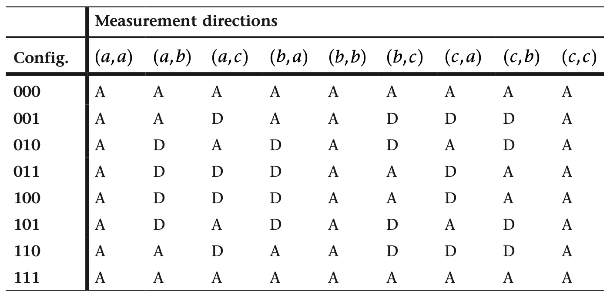

我们之前学习的理论都来自于量子力学的**哥本哈根解释**（Copenhagen interpretation），但在量子力学的早期发展阶段，还有另一种解释——**隐变量理论**（Hidden variable theory）. **贝尔定理**（Bell's theorem）则通过一个巧妙的实验来区分这两种解释.

---

## 隐变量理论

隐变量理论认为，量子力学中的随机性是因为我们无法观测到系统的所有**隐变量**，而不是因为系统本身是随机的. 也就是说，如果我们能够观测到所有的隐变量，那么量子力学的预测就会变得确定.

我们先来看看隐变量理论如何解释量子纠缠.

---

考虑量子态为 $\frac{1}{\sqrt{2}}\lvert\uparrow\rangle\lvert\uparrow\rangle+\frac{1}{\sqrt{2}}\lvert\downarrow\rangle\lvert\downarrow\rangle$ 的两个电子，实验结果表明它们的测量结果一定相同. 在隐变量理论的解释中，这两个电子在产生纠缠的时候，就**已经确定了各自的自旋方向**.

::fold{expand info title=纸牌类比}
设想有一桌打乱的纸牌，我们从中随机选出一张，并且不看它，然后把它从中间撕成两半，分别寄给远在宇宙两端的 Alice 和 Bob.

Alice 和 Bob 对收到的牌的类型一无所知，但一旦他们看到自己手中的牌，就能立刻知道对方手中的牌的类型. 在其中并没有什么超距作用，只是因为这两张牌在一开始就已经确定了.
::

隐变量理论认为，**测量的结果在测量之前已经确定了**；哥本哈根解释认为，**测量的结果是在测量时才确定的**. 这一问题即为赫赫有名的 **EPR 佯谬**（Einstein-Podolsky-Rosen paradox）.

---

## 贝尔实验

设想我们生成一系列的电子对，每对电子**都处于 $\frac{1}{\sqrt{2}}\lvert\uparrow\rangle\lvert\uparrow\rangle+\frac{1}{\sqrt{2}}\lvert\downarrow\rangle\lvert\downarrow\rangle$ 的纠缠态**，每一对的电子都分别发给 Alice 和 Bob.

Alice 在 $0^\circ$、$120^\circ$ 和 $240^\circ$ 中**等概率随机选择一个方向**，测量自己手中的电子的自旋并得到一个 0 或 1 的结果. 在 Alice 测量之后，Bob 也随机选择一个方向，并测量自己手中的电子的自旋.

所有电子对测量结束后，Alice 和 Bob 都得到了一个 01 串，然后我们一位一位地**比较两个 01 串的内容**，如果相同写下 A（Agree），不同写下 D（Disagree），最后我们**统计 A 的占比**.

理论分析表明，**两种解释对于 A 的占比会有不同的预测**.

### 哥本哈根解释的预测

首先，如果 Alice 和 Bob 都选到了相同的测量方向，也就是相同的**基**，那么他们的测量结果一定相同，接下来我们考虑基不同的情况.

例如，如果 Alice 选到了 $(\lvert\searrow\rangle, \lvert\nwarrow\rangle)$，Bob 选到了 $(\lvert\swarrow\rangle, \lvert\nearrow\rangle)$. Alice 先进行测量，因此需要将 $\frac{1}{\sqrt{2}}\lvert\uparrow\rangle\lvert\uparrow\rangle+\frac{1}{\sqrt{2}}\lvert\downarrow\rangle\lvert\downarrow\rangle$ 投影到 Alice 的基下. 首先我们有如下定理.

::fold{expand success title=定理}
对任意的基 $(\lvert b_0\rangle, \lvert b_1\rangle)$，有

$$
\frac{1}{\sqrt{2}}\begin{bmatrix}1\\0\end{bmatrix}\otimes\begin{bmatrix}1\\0\end{bmatrix} + \frac{1}{\sqrt{2}}\begin{bmatrix}0\\1\end{bmatrix}\otimes\begin{bmatrix}0\\1\end{bmatrix} = \frac{1}{\sqrt{2}}\lvert b_0\rangle\lvert b_0\rangle+\frac{1}{\sqrt{2}}\lvert b_1\rangle\lvert b_1\rangle.
$$

易证.
::

因此原量子态**等于** $\frac{1}{\sqrt{2}}\lvert\searrow\rangle\lvert\searrow\rangle+\frac{1}{\sqrt{2}}\lvert\nwarrow\rangle\lvert\nwarrow\rangle$. 这说明 Alice 测量之后系统**等概率坍缩**到 $\lvert\searrow\rangle\lvert\searrow\rangle$ 或 $\lvert\nwarrow\rangle\lvert\nwarrow\rangle$，然后 Bob 开始测量.

当系统坍缩到 $\lvert\searrow\rangle\lvert\searrow\rangle$ 时，Bob 拿到的电子是 $\lvert\searrow\rangle$，而 $\lvert\searrow\rangle = \frac{1}{2}\lvert\swarrow\rangle + \frac{\sqrt{3}}{2}\lvert\nearrow\rangle$，因此 Bob 有 $1/4$ 的概率得到 0，有 $3/4$ 的概率得到 1，也就是说有 **$1/4$ 的概率**得到与 Alice 相同的结果. 同理，当系统坍缩到 $\lvert\nwarrow\rangle\lvert\nwarrow\rangle$ 时，Bob 有 **$1/4$ 的概率**得到相同的结果.

他们有 $1/3$ 的时间选到相同的基，这种情况下结果相同的概率是 $1$；有 $2/3$ 的时间选到不同的基，对应概率 $1/4$，因此 AD 串中 A 的比例应该为

$$
\frac{1}{3}\times 1 + \frac{2}{3}\times \frac{1}{4} = \frac{1}{2}.
$$

---

### 隐变量理论的预测

因为**每个方向上**的测量结果在测量之前就已经确定了，所以系统一开始有 $2^3=8$ 种可能：000、001、010、011、100、101、110、111，每一位分别代表 $(\lvert\uparrow\rangle, \lvert\downarrow\rangle)$、$(\lvert\searrow\rangle, \lvert\nwarrow\rangle)$ 和 $(\lvert\swarrow\rangle, \lvert\nearrow\rangle)$ 的测量结果.

记 $(\lvert\uparrow\rangle, \lvert\downarrow\rangle)$ 为 $a$，$(\lvert\searrow\rangle, \lvert\nwarrow\rangle)$ 为 $b$，$(\lvert\swarrow\rangle, \lvert\nearrow\rangle)$ 为 $c$，用 $(a, b)$ 表示 Alice 在 $a$ 方向测量，Bob 在 $b$ 方向测量的结果. 下表给出了所有可能的结果.

此处我们**不知道 $8$ 种初始情况的概率分布**，但每一个初始情况中，Alice 和 Bob 选择某组特定的方向的概率是确定的，都是 $1/9$.

上表中，每一行至少有 $5$ 个 A，这说明每个初始情况至少有 $5/9$ 的概率会得到 A，因此**总的 A 的比例至少是 $5/9$**，这与哥本哈根解释的预测不同.

---

### 实验结果

关于该验证方法的首次实验在 1972 年进行，实验结果表明 A 和 D 出现的频率均等，但由于实验仍有一些未能排除的漏洞，说服力不足. 2015 年，Ronald Hansen 等人的实验成功排除所有漏洞，严格证明了**哥本哈根解释**的正确性.

---

## Ekert 密钥分发协议

**Ekert 密钥分发协议**是一种基于量子纠缠的密钥分发协议，又称为 **E91 协议**，它（的某一个变种）的原理和贝尔实验类似.

和贝尔实验一样，Alice 和 Bob 分别得到一系列电子对，每对电子都处于 $\frac{1}{\sqrt{2}}\lvert\uparrow\rangle\lvert\uparrow\rangle+\frac{1}{\sqrt{2}}\lvert\downarrow\rangle\lvert\downarrow\rangle$ 的纠缠态，然后 Alice 和 Bob 在三个测量方向中等概率随机选择一个，测量自己的电子的自旋，并记录下选择的基.

完成 $3n$ 次测量后，Alice 和 Bob 通过公开的信道比较他们的基. 一共会有大约 $n$ 个基相同，**选择对应的测量结果作为密钥**.

然后 Alice 和 Bob 需要验证没有第三者监听，他们通过公开的信道**比对剩下的 $2n$ 个比特**. 假设 Eve 对密钥分发过程进行监听，那么她一定需要进行测量，这样就会**破坏电子对的纠缠态**. 从贝尔实验的计算结果得到，如果没有监听，在这 $2n$ 个比特中，**不相同的概率是 $1/4$**. 如果监听了，容易计算出**不相同的概率会变成 $3/8$**.

通过统计剩下的 $2n$ 个比特中**不同的比特数**，Alice 和 Bob 确认是否有监听.

该协议已经在实验室中通过纠缠态的光子成功实现.
