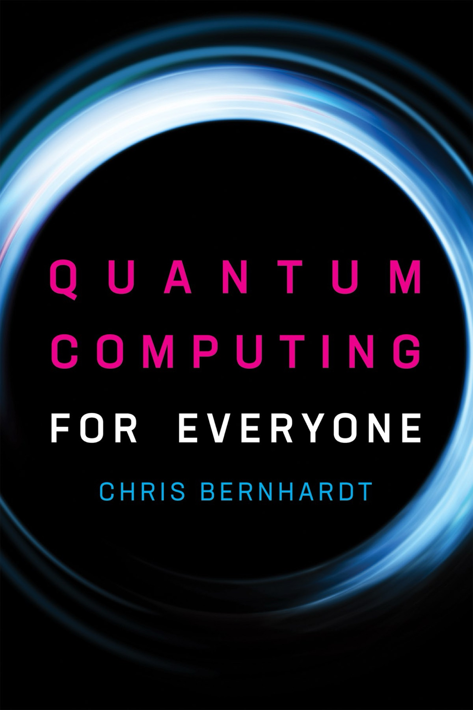

::fold{always expand info title="摘要"}

&nbsp;:book: *Quantum Computing for Everyone* 书籍阅读笔记

&nbsp;:clock: **开始时间**：2025 年 2 月 9 日

&nbsp;:clock: **结束时间**：2025 年 2 月 17 日

&nbsp;:pencil: **书籍评价**：本书十分入门，很多方面进行了简化，只需要高中数学水平即可理解，适合非计算机专业学生阅读，计算机专业的学生一周之内看完绰绰有余，可以茶余饭后读一读，**不建议将其视为专业课程的自学教材**.

&nbsp;:triangle-exclamation: **注意事项**：笔者只记录了前 7 章的笔记，由于剩下两章 Quantum Algorithms 和 Impact of Quantum Computing 只是简单介绍了一下量子算法，过于简单，没有必要记录笔记.
::

:asterisk

:index
