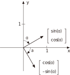
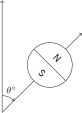

本章正式给出**量子比特**的定义及其数学模型，并且介绍了一种基础的量子密钥分发协议——**BB84 协议**.

---

## 量子叠加态

电子在经过一次 Stern-Gerlach 装置的测量后，会有形成**两种可能的结果**，因此我们的研究是在一个**二维**的向量空间内进行的. 在本书中我们只研究二维平面的量子现象，因此更进一步局限到 **$\mathbb{R}^2$** 上，对于三维的情况，则是 $\mathbb{C}^2$.

在我们的数学模型中，只考虑**单位向量**.

选择装置的**测量方向对应于选择一个有序基 $(\lvert b_1\rangle, \lvert b_2\rangle)$**，其中的**两个向量对应着两种可能的测量结果**，我们将前者与自旋 N 对应，后者与自旋 S 对应.

在进行测量之前，电子处于 $\lvert b_1\rangle$ 和 $\lvert b_2\rangle$ 的**叠加态**，我们用 $(\lvert b_1\rangle, \lvert b_2\rangle)$ 的**线性组合**来表示这个态，即 **$c_1\lvert b_1\rangle + c_2\lvert b_2\rangle$**，其中 $c_1, c_2 \in \mathbb{R}$ 且 $c_1^2 + c_2^2 = 1$.

在测量之后，电子会**坍缩**到 $\lvert b_1\rangle$ 和 $\lvert b_2\rangle$ 其中的一个态上，并且**测量结果为 $\lvert b_1\rangle$ 的概率为 $c_1^2$，为 $\lvert b_2\rangle$ 的概率为 $c_2^2$**. 参数 $c_1$ 和 $c_2$ 称为**概率振幅**（Probability amplitude）.

---

例如，在一开始选择的**竖直方向**的实验装置中，所对应的**基为 $(\lvert\uparrow\rangle, \lvert\downarrow\rangle)$**，其中

$$
\lvert\uparrow\rangle = \begin{bmatrix}1\\0\end{bmatrix},\quad\lvert\downarrow\rangle = \begin{bmatrix}0\\1\end{bmatrix}.
$$

第一个向量代表着电子上旋，即在 $0^\circ$ 方向自旋为 N；第二个向量代表着电子下旋，即在 $0^\circ$ 方向自旋为 S. **水平方向**的实验装置对应的**基为 $(\lvert\rightarrow\rangle, \lvert\leftarrow\rangle)$**，其中

$$
\lvert\rightarrow\rangle = \begin{bmatrix} \dfrac{1}{\sqrt{2}} \\[1em] \dfrac{-1}{\sqrt{2}} \end{bmatrix},\quad\lvert\leftarrow\rangle = \begin{bmatrix} \dfrac{1}{\sqrt{2}} \\[1em] \dfrac{1}{\sqrt{2}} \end{bmatrix}.
$$

设想一个初始态未知的电子射向**竖直方向**的装置，它的初始态一定可以写成 **$c_1\lvert\uparrow\rangle + c_2\lvert\downarrow\rangle$**，其中 $c_1^2 + c_2^2 = 1$. 然后我们开始测量，此时电子有 $c_1^2$ 的概率坍缩到 $\lvert\uparrow\rangle$，有 $c_2^2$ 的概率坍缩到 $\lvert\downarrow\rangle$.

现在我们重复相同的实验，继续在**竖直方向**上进行测量，假设初始测量结果是 $\lvert\uparrow\rangle$，那么在下一次测量中，电子的初始态就是 $\lvert\uparrow\rangle=1\lvert\uparrow\rangle+0\lvert\downarrow\rangle$，$c_1^2=1, c_2^2=0$. 意味着再次进行相同的测量时，**电子必然会仍然维持在 $\lvert\uparrow\rangle$**.

如果第二次实验选择在**水平方向**进行测量，假设第一次竖直方向的测量结果是 $\lvert\uparrow\rangle$，我们需要**把它写成水平方向的基的线性组合**，即求解 $x_1, x_2$ 使得

$$
\lvert\uparrow\rangle = x_1\lvert\rightarrow\rangle + x_2\lvert\leftarrow\rangle.
$$

::fold{expand info title=求解过程}
在上一章我们已经知道如何计算这个式子，首先写出基的矩阵形式

$$
B = \begin{bmatrix} \lvert\rightarrow\rangle & \lvert\leftarrow\rangle \end{bmatrix} =  \begin{bmatrix} \dfrac{1}{\sqrt{2}} & \dfrac{1}{\sqrt{2}} \\[1em] \dfrac{-1}{\sqrt{2}} & \dfrac{1}{\sqrt{2}} \end{bmatrix},
$$

然后将其求转置，再乘以 $\lvert\uparrow\rangle$，即

$$
\begin{bmatrix}x_1\\x_2\end{bmatrix} = B^\top\lvert\uparrow\rangle = \begin{bmatrix} \dfrac{1}{\sqrt{2}} & \dfrac{-1}{\sqrt{2}} \\[1em] \dfrac{1}{\sqrt{2}} & \dfrac{1}{\sqrt{2}} \end{bmatrix} \begin{bmatrix}1\\0\end{bmatrix} = \begin{bmatrix} \dfrac{1}{\sqrt{2}} \\[1em] \dfrac{1}{\sqrt{2}} \end{bmatrix}.
$$
::

因此，$\lvert\uparrow\rangle = \dfrac{1}{\sqrt{2}}\lvert\rightarrow\rangle + \dfrac{1}{\sqrt{2}}\lvert\leftarrow\rangle$，这说明在第二次测量时，有 $1/2$ 的概率测量结果为 $\lvert\rightarrow\rangle$，有 $1/2$ 的概率测量结果为 $\lvert\leftarrow\rangle$. 这和实验结果是一致的.

::fold{expand success title=等价量子叠加态}
设 $\lvert v\rangle=c_1\lvert b_1\rangle+c_2\lvert b_2\rangle$，那么 $-\lvert v\rangle=-c_1\lvert b_1\rangle-c_2\lvert b_2\rangle$，它们对应的概率都是 $c_1^2$ 和 $c_2^2$，因此它们无法通过实验来区分，我们称这两个态是**等价的**.
::

---

## 基的旋转

从标准基 $\left(\begin{bmatrix}1\\0\end{bmatrix}, \begin{bmatrix}0\\1\end{bmatrix}\right)$ 出发，**顺时针旋转 $\alpha$ 角**，得到 $\left(\begin{bmatrix}\cos\alpha\\-\sin\alpha\end{bmatrix}, \begin{bmatrix}\sin\alpha\\\cos\alpha\end{bmatrix}\right)$.

::grid{gap=10px}
:sep{span=12}
{.inv width=250px}

:sep{span=12}
{.inv width=140px}
::

当旋转 $\alpha=90^\circ$ 时，得到基 $\left(\begin{bmatrix}\cos90^\circ\\-\sin90^\circ\end{bmatrix}, \begin{bmatrix}\sin90^\circ\\\cos90^\circ\end{bmatrix}\right)=\left(\begin{bmatrix}0\\-1\end{bmatrix}, \begin{bmatrix}1\\0\end{bmatrix}\right)$，而 $\begin{bmatrix}0\\-1\end{bmatrix}$ 等价于 $\begin{bmatrix}0\\1\end{bmatrix}$，所以旋转 $90^\circ$ 就相当于**交换两个基向量**.

如果用 $\theta$ 表示实验装置的旋转角度，那么 $\theta$ 从 $0^\circ$ 转到 $180^\circ$ 等价于 $\alpha$ 从 $0^\circ$ 转到 $90^\circ$，所以**有 $\theta = 2\alpha$**. 因此，竖直方向的实验装置旋转 $\theta$ 角得到的基向量为

$$
\left(\begin{bmatrix}\cos\left(\dfrac{\theta}{2}\right)\\[1em]-\sin\left(\dfrac{\theta}{2}\right)\end{bmatrix}, \begin{bmatrix}\sin\left(\dfrac{\theta}{2}\right)\\[1em]\cos\left(\dfrac{\theta}{2}\right)\end{bmatrix}\right).
$$

---

## 量子比特

定义**量子比特为 $\mathbb{R}^2$ 空间内的任何单位 Ket**. 给定一个用于测量的基 $(\lvert b_0\rangle, \lvert b_1\rangle)$，定义 **$\lvert b_0\rangle$ 代表比特 0，$\lvert b_1\rangle$ 代表比特 1**，而其他的态则是**叠加态**. 在量子计算中，为了获得计算结果，我们必须对量子比特进行观测，而观测必定会导致量子比特坍缩为某个基向量，所以**最终得到的一定是传统意义上的 01 比特**.

---

## 量子干涉

考虑 $\lvert\leftarrow\rangle$ 和 $\lvert\rightarrow\rangle$ 两个量子比特，如果我们在标准基下进行测量，它们分别都有 $1/2$ 的概率测量结果为 0 和 1. 现在我们**对两者进行叠加**，得到 $\lvert v\rangle=\frac{1}{\sqrt{2}}\lvert\leftarrow\rangle+\frac{1}{\sqrt{2}}\lvert\rightarrow\rangle$，然后再在标准基下进行测量，得到的**结果一定是 0**，因为

$$
\lvert v\rangle = \frac{1}{\sqrt{2}}\lvert\leftarrow\rangle+\frac{1}{\sqrt{2}}\lvert\rightarrow\rangle = 1\lvert\uparrow\rangle+0\lvert\downarrow\rangle.
$$

这说明 $\lvert\leftarrow\rangle$ 和 $\lvert\rightarrow\rangle$ 中产生 0 的项**干涉相长**（Interfered constructively），产生 1 的项**干涉相消**（Interfered destructively）.

---

## BB84 密钥分发协议

**BB84** 协议得名于它的发明者 Charles Bennett 和 Gilles Brassard，以及它的发明年份 1984 年. 这是一个**基于量子力学的密钥分发协议**，它的安全性基于**量子力学的不可克隆性**. 该协议使用如下两组基：

$$
\begin{align*}
V &= (\lvert\uparrow\rangle, \lvert\downarrow\rangle) = \left(\begin{bmatrix}1\\0\end{bmatrix}, \begin{bmatrix}0\\1\end{bmatrix}\right),\\[1em]
H &= (\lvert\rightarrow\rangle, \lvert\leftarrow\rangle) = \left(\begin{bmatrix}\dfrac{1}{\sqrt{2}}\\[1em]\dfrac{-1}{\sqrt{2}}\end{bmatrix}, \begin{bmatrix}\dfrac{1}{\sqrt{2}}\\[1em]\dfrac{1}{\sqrt{2}}\end{bmatrix}\right).
\end{align*}
$$

假设 Alice 相和 Bob 沟通密钥，并且想要确保中途没有被别人（设为 Eve）监听.

首先，Alice 生成一串长度为 $4n$ 的常规比特序列（$n$ 需要足够大），对于每一个比特，**等概率随机选择一个对应的基 $V$ 或 $H$**，然后将其转换为量子比特，发送给 Bob. 例如，如果想要发送 0，并且随机选择了基 $H$，那么 Alice 会发送 $\lvert\rightarrow\rangle$. 同时 **Alice 在本地保存每个比特选择的基的记录**.

Bob 同样等概率**随机选择一系列 $4n$ 个 $V$ 或 $H$**，然后用它们分别对 Alice 发送的量子比特进行观测，并在本地留存记录.

由于 Alice 和 Bob 选择的基是随机的，对于每一个比特，他们有 $1/2$ 的概率选到相同的基，此时 Bob 会获得正确的结果；有 $1/2$ 的概率选到不同的基，此时 Bob 又有 $1/2$ 的概率选到正确的基（想一下 Stern-Gerlach 实验），但是由于无法确定是否正确，所以 **Bob 最终得到的比特串中只有 $2n$ 个是正确的**. 

Alice 和 Bob 通过公开的信道交换他们的基选择记录，然后**去掉不匹配的基对应的比特**，剩下 $2n$ 个比特.

如果 Eve 想要监听，她必须**拦截并重新发送** Alice 发送的量子比特，但是**想要保证重新发送的量子比特和原始的量子比特一致是不可能的**，因为 Eve 无法知道 Alice 选择的基，一旦拦截，量子比特就会**不可逆地**坍缩为她选择的某个基向量，并且由于概率都是 $1/2$，所以**Eve 无法完全模拟 Alice 的行为**.

但是 Eve 可能采用另一个策略，假设她拦截了 Alice 发送的量子比特，然后**在 $V$ 和 $H$ 两个基中随机选择一个进行观测**，然后再将观测结果转发给 Bob，我们考虑一下这种情况.

假如 Eve 没有监听，那么 Alice 和 Bob 的比特串会有 $2n$ 个是匹配的. 但如果监听了，Eve 有一半的可能选到错误的基并对量子比特进行了修改，因此 Bob **只有 $1/4$ 的概率得到正确的比特**.

现在 Alice 和 Bob **通过公开的信道比较 $2n$ 个匹配当中的 $n$ 个比特**，如果完全一致，说明没有监听，他们可以使用剩下的 $n$ 个比特作为密钥；如果有 $1/4$ 的比特不一致，说明通信被监听了，他们需要**通过其他方式重新建立通信**.
