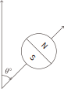

一个**量子比特**（Quantum bit, Qubit）是量子计算的基本单元，它可以由**电子自旋**或**光子偏振**来表示. 在介绍量子比特之前，我们先从一个实验引入.

---

## Stern-Gerlach 实验

在玻尔的原子行星轨道模型中，电子绕核旋转产生磁场，其中内层电子磁场正反抵消，而外层电子可能无法抵消. 因此在某些原子（例如银原子）中，最外层电子会让整个原子带上一个**微小磁矩**. 据此原理，Otto Stern 和 Walther Gerlach 设计了一个实验，尝试观测银原子的磁矩方向.

{.inv width=450px}

装置中间的 V 形磁体会产生一个非均匀磁场，使得 S 极的效果比 N 极强. 如果银原子 N 极朝上，那么它会受到磁体 S 极更强的吸引力，最终向上偏转；反之，如果 S 极朝上，那么他会被磁体 S 极排斥，从而向下偏转. 如果 NS 极水平，那就不会偏转.

理论上来说，由于射出的银原子的磁矩方向是随机的，那么在屏幕上应该会出现一个连续的条纹. 但实验结果并不是这样，而是只出现了最上方和最下方两个点，说明这个**观测行为本身对银原子的方向产生了影响**.（具体物理原理不在本书讨论范围内）

---

## Spin

电子本身也有类似上述银原子的性质，对于不同的实验结果，我们定义电子的**自旋**（Spin）方向如下：（圆圈表示电子落到屏幕上的位置）

::grid{gap=5px}
:sep{span=5}
{.inv width=60px}

:sep{span=1 .center}
$\Longrightarrow$

:v{3rem}

:sep{span=5}
{.inv width=55px}

:sep{span=5 offset=1}
{.inv width=60px}

:sep{span=1 .center}
$\Longrightarrow$

:v{3rem}

:sep{span=5}
{.inv width=55px}
::

为了在二维平面内更好地描述自旋，定义电子旋转的角度如下：

{.inv width=140px}

竖直向上为 $0^\circ$，顺时针旋转为正方向.

在研究电子自旋之前，我们先看一个**量子钟隐喻**.

::fold{expand info title=量子钟隐喻}
设想一个挂在墙上的钟，它的指针可以指向 12 个小时刻度，但是你看不到钟面，只能向它提问来得到时间，而且**只能提问 “现在是不是某点？”** 这样的问题.

在经典物理学当中，如果你提问 “现在是不是 3 点”，那么你有 $1/12$ 的概率得到 “是” 的回答，这是很自然的. 但是我们这个量子钟不一样，不管你问它现在是不是几点，它一定**要么回答 “是”，要么回答 “现在的时间是你提问的时间都指针反方向指向的那个时间”**. 例如你问它 “现在是不是 3 点”，它要么回答 “是”，要么回答 “现在是 9 点”.
::

这个隐喻可以帮助我们理解电子自旋的性质. 在 Stern-Gerlach 实验中，银原子的朝向本身是有 $0\sim360^\circ$ 无限种可能的，但是在观测之后，它要么回答 $0^\circ$，要么回答 $180^\circ$.

---

## 多次测量

在 Stern-Gerlach 实验（的电子版本）中，如果在自旋为 N 的电子射出的位置再加一个和第一个装置朝向相同的装置，也就是再进行一次相同的测量，实验表明，**第二次测量的结果和第一次测量的结果是一样的**. 也就是说，如果第一次测量得到的是 N，那么第二次测量也是 N；如果第一次测量得到的是 S，那么第二次测量也是 S. 不管再后面进行多少次测量，**只要测量的方向相同，结果都是一样的**.

然而，如果第二个装置旋转了 $90^\circ$，实验表明，**第二次测量的结果完全随机**，$50\%$ 的概率是 N，$50\%$ 的概率是 S. 这个随机是**真随机**，理论可以证明，**不可能通过任何手段来预测第二次测量的结果**.

更进一步，在旋转 $90^\circ$ 的装置后再加上和第一个装置朝向相同的装置，我们发现**第三次测量结果仍然是随机的**. 也就是说，如果连着三次相同测量，结果是相同的，但仅仅是把第二次测量的装置旋转了 $90^\circ$，原本相同的第一、第三次结果竟然变成不一样的了.
