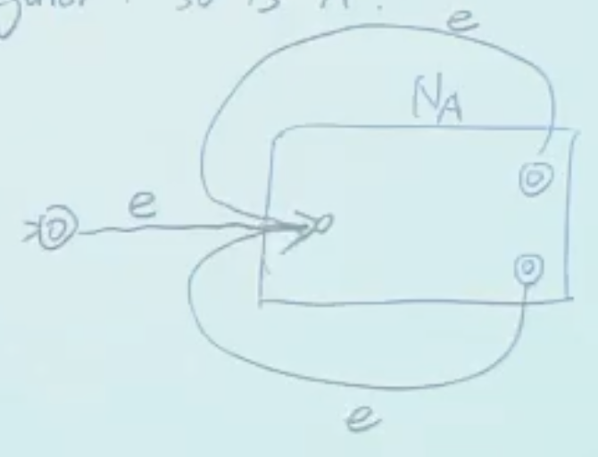

## NFA

::fold{title="**定理**：NFA 不比 DFA 强" success always expand}
DFA 和 NFA 能表示的语言/布尔函数是一样的。（NFA 不能表示更多语言）

:::fold{title="证明" expand}
DFA 转 NFA 是显然的，考虑 NFA 转 DFA。

对 $p\in K$，定义 $E(p)$ 为从 $p$ 出发通过 e-transition 能到达的所有状态集合（可能是多次）。

对状态集合 $Q\subseteq K$，定义 $Q'_a = \bigcup_{q\in Q}\bigcup_{p: (p, a, q) \in \Delta}E(p)$，即对 $Q$ 的所有状态，找出能通过输入 $a$ 到达的所有状态，以及这些状态通过 e-transition 能到达的所有状态。

定义 DFA：

-   $K' = 2^K = \{Q \mid Q \subseteq K\}$ 即所有状态集合的集合
-   $s' = E(s)$，即 NFA 最顶层的状态集合
-   $F' = \{Q \subseteq K \mid Q \cap F \neq \varnothing\}$，即包含 NFA 接受状态的所有状态集合
-   $\delta'(Q, a) = Q'_a$，即对状态集合 $Q$ 和输入 $a$，找出能通过 $a$ 到达的所有状态集合

:::
::

因此**要判断是不是正则的，只需要证明能由 DFA 表示即可**。

::fold{title="**证明**：A、B 正则，则 AB 也是正则" expand}
对输入需要选择一个切分点切开。

1. 取两个自动机的状态集合并为不相交的集合；
2. 将所有 $A$ 的终止状态加上 e-transition 到 $B$ 的初始状态；
3. $M$ 的初始状态为 $A$ 的初始状态；
4. $M$ 的终止状态为 $B$ 的终止状态。

::

::fold{title="**定理**" success always expand}
若 $A$ 是正则的，则 $A^*$ 也是正则的，其中 $A^* = \{a_1 a_2 \ldots a_n \mid n \geq 0, a_i \in A\}$。

:::fold{title="证明" expand}
和上面类似，只不过需要找无穷个切分点。

把 $A$ 的所有终止状态加上 e-transition 到 $A$ 的初始状态，并且把初始状态也设为终止状态（接受空串）。

:::
::

## 正则表达式

-   **Base case**：
    -   $\varnothing$ 是正则表达式，表示空集
    -   对 $a \in \{0,1\}$，$a$ 是正则表达式，表示 $\{a\}$
-   **Inductive case**：若 $R_1$ 和 $R_2$ 是正则表达式，则
    -   $R_1 \cup R_2$ 是正则表达式，表示 $L(R_1) \cup L(R_2)$
    -   $R_1 R_2$ 是正则表达式，表示 $L(R_1)L(R_2)$
    -   $R_1^*$ 是正则表达式，表示 $L(R_1)^*$

**运算符优先级**：$*$ > 连接 > $\cup$。

**例子**：

-   $\{e\}$ 的正则表达式为 $\varnothing^*$。
-   所有以 0 开始 1 结束的串： $0(0\cup1)^*1$。
-   至少有两个 0 的串： $(0\cup1)^*0(0\cup1)^*0(0\cup1)^*$（两个 0 定下来，之间可以有任意串）。

::fold{title="**定理**" success always expand}
所有正则的语言都可以被正则表达式表示，所有能被正则表达式表示的语言都是正则的。

:::fold{title="证明" expand}
只需证明 NFA 和正则表达式等等价。右到左显然，考虑左到右。

略（在 Lec06 讲的，直觉上是通过删 node 实现，理论上是一个 DP 过程，没有详细记笔记，期末记得看一下视频）。
:::
::
