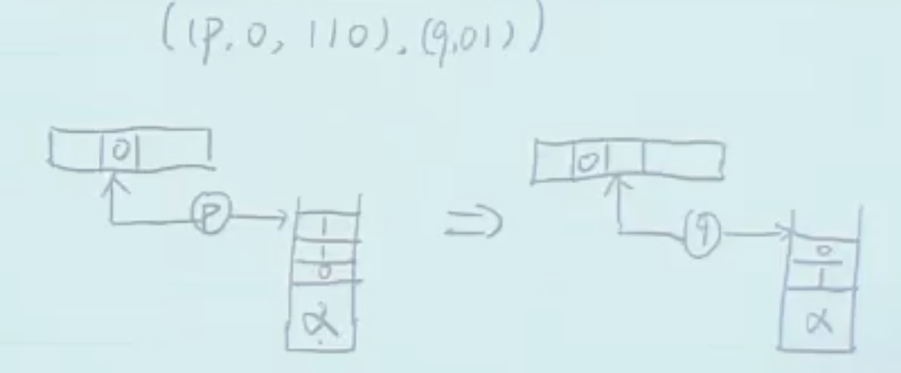

之前学的 DFA、NFA、RegExp 的表达能力等价，都很有限，甚至无法表达一些简单的语言，比如 $\{0^n1^n \mid n \geqslant 0\}$。因此本节课尝试对其扩展。

## Pushdown Automaton (PDA)

**PDA = DFA + Stack**（额外加了内存部分）。

**PDA**：$P = (K, \Delta, s, F)$，其中

-   $K$、$s$、$F$ 同 DFA；
-   $\Delta$ 仍然是转移函数，但变成了 $(K\times\{0,1,e\}\times\{0,1\}^*)\times(K\times\{0,1\}^*)$ 的**有限子集**。其中：
    -   $K$：当前状态
    -   $\{0,1,e\}$：当前读入的非确定性 symbol（和 NFA 一致）
    -   $\{0,1\}^*$：从当前栈顶 pop 出来的串
    -   $K$：下一个状态
    -   $\{0,1\}^*$：push 进栈的串
-   e.g. $((p,0,110),(q,01))$：如果当前状态为 p，读到 0，且栈顶为 110，则转移到状态 q，并将栈顶的 110 pop 出，push 入 01。
    

---

**配置（Configuration）**：三元组 $(p, x, \alpha) \in K \times \{0,1\}^* \times \{0,1\}^*$，表示当前状态为 $p$，纸带**剩余**输入串为 $x$（因为之前读入的已经不会影响后续结果了），栈内容为 $\alpha$。

**Yield in one step**：$(p, x, \alpha) \vdash_P (q, y, \beta)$，表示从配置 $(p, x, \alpha)$ 可以通过**一次转移**到达配置 $(q, y, \beta)$，下标 $P$ 表示 PDA。符号 $\vdash_P$ 读作“yields in one step”。

**Yield**：$\vdash_P^*$ 为 $\vdash_P$ 的闭包，表示通过**若干次转移**可以从一个配置到达另一个配置。读作“yields”。

**$P$ accepts $w\in\{0,1\}^*$, if $(s, w, e) \vdash_P^* (f, e, e)$ for some $f \in F$.** 即从初始配置 $(s, w, e)$ 出发，经过若干次转移，可以到达某个接受状态 $f$，且此时纸带和栈均清空。

**Language of $P$** $L(P)$ 为被 $P$ 接受的所有字符串的集合。称 $P$ **decides** $L(P)$。如果语言 $L$ 能被某台 PDA 判定，则称 $L$ 为**上下文无关语言（Context-Free Language, CFL）**。

::fold{title="例题" info always expand}

1. 设计 PDA 接受语言 $L = \{w\in\{0,1\}^* \mid \text{\#0's = \#1's in } w\}$（即 0 和 1 个数相同）。  
   $K = \{q\}$，$s = q$，$F = \{q\}$，$\Delta$ 包含以下转移：
    - $((q,0,e), (q,0))$：读到 0，不管栈顶是什么，都 push 入 0；
    - $((q,0,1), (q,e))$：读到 0，栈顶为 1，则 pop 出 1（PDA 和 NFA 类似，也能去“猜”，所以和上一条不矛盾）；
    - $((q,1,e), (q,1))$：读到 1，不管栈顶是什么，都 push 入 1；
    - $((q,1,0), (q,e))$：读到 1，栈顶为 0，则 pop 出 0。
2. 设计 PDA 接受语言 $L = \{ww^\text{Reverse} \mid w\in\{0,1\}^*\}$（即任意串拼上其逆序串）。  
   $K = \{l, r\}$，$s = l$，$F = \{r\}$，$\Delta$ 包含以下转移：
    - $((l,0,e), (l,0))$：读到 0，不管栈顶是什么，都 push 入 0；
    - $((l,1,e), (l,1))$：读到 1，不管栈顶是什么，都 push 入 1；
    - $((l,e,e), (r,e))$：通过 $e$-transition 转移到状态 $r$；
    - $((r,0,0), (r,e))$：读到 0，栈顶为 0，则 pop 出 0；
    - $((r,1,1), (r,e))$：读到 1，栈顶为 1，则 pop 出 1。

::

---

之前研究的 DFA、NFA、PDA 都属于 **Language Recognizer**，即给定一个字符串，判断其是否属于某个语言。接下来研究 **Language Generator**，即通过某种规则生成语言中的字符串。

研究 **Language Generator** 的一个重要工具是 **语法（Grammar）**。

## Context-Free Grammar (CFG)

**CFG**：$G = (V, S, R)$，其中

-   $V$：有限符号集合，包括 $\{0,1\}$。其中 $V\setminus\{0,1\}$ 中的符号称为**非终结符（Non-terminal）**，与之相对 $0,1$ 称为**终结符（Terminal）**
-   $S \in V\setminus\{0,1\}$：Start Symbol，属于非终结符
-   $R \subset (V \setminus \{0,1\}) \times V^*$：有限规则集合（右侧是无穷集，但是要求 $R$ 有限）

---

**Derive in one step**：对 $x, y, u \in V^*$，$A \in V\setminus\{0,1\}$，如果 $(A, u) \in R$，则有 $xAy \Rightarrow_G =xuy$，符号 $\Rightarrow_G$ 读作“derives in one step”。

**Derive**：$\Rightarrow_G^*$ 为 $\Rightarrow_G$ 的闭包，即可以用多次规则替换。

**$G$ generates $w \in \{0,1\}^*$, if $S \Rightarrow_G^* w$.** 即从 Start Symbol $S$ 出发，经过若干次规则替换，可以得到字符串 $w$。

**Language of $G$** $L(G)$ 为被 $G$ 生成的所有字符串的集合。称 $G$ **generates** $L(G)$。

::fold{title="例题" info always expand}
设计 CFG 生成语言 $L = \{w\in\{0,1\}^* \mid w=w^\text{Reverse}\}$（即回文串）：

$S \to e \mid 0 \mid 1 \mid 0S0 \mid 1S1$（竖线表示“或”）
::

---

::fold{title="**定理**：PDA 和 CFG 等价" success always expand}
对于语言 $L$，存在 PDA $P$ 接受 $L$ 当且仅当存在 CFG $G$ 生成 $L$。

:::fold{title="证明" expand}
**$P\Leftarrow G$：**

> 思路：1. 非确定性地在栈上构造目标串；2. 读入目标串并与栈上内容相消；3. 若栈空且读完输入串，则接受。

令 $G = (V, S, R)$，构造 $P = (K, \Delta, s, F)$ 如下：

-   $K = \{p, q\}$，$s = p$，$F = \{q\}$；
-   $\Delta$ 包含以下转移：
    -   $((p,e,e), (q,S))$：初始时将 $S$ push 入栈，并转移到状态 $q$；
    -   $((q,e,A), (q,u))$ for $\forall (A,u) \in R$：非确定性地用规则替换栈顶的非终结符 $A$ 为 $u$；
    -   $((q,a,a), (q,e))$ for $\forall a \in \{0,1\}$：读入输入串并与栈顶内容相消；

---

**$P\Rightarrow G$：**

> 思路：先化简 PDA，然后再构造 CFG。

将 $P$ 化简为满足以下条件的 $P = (K, \Delta, s, F)$：

1. 只有一个接受状态 $f$，即 $F = \{f\}$；
2. 每次转移要么只 push，要么只 pop，而且每次只 push/pop 一个 symbol。

显然任意 PDA 都可以化简为满足上述条件的 PDA。

构造 CFG $G = (V, S, R)$ 如下：

-   $V = \{0,1\} \cup \{A_{p,q} \mid p,q \in K\}$，其中 $A_{p,q}$ 为非终结符，表示从状态 $p$ 出发，经过若干次转移，到达状态 $q$ 且栈空的字符串集合，**我们的目标是实现 $A_{p,q} \Rightarrow_G^* w$ iff $(p, w, e) \vdash_P^* (q, e, e)$**；
-   $S = A_{s,f}$；
-   $R$ 包含以下规则：
    -   **空串规则** $A_{p,p} \to e$；
    -   **连接规则** $A_{p,q} \to A_{p,r} A_{r,q}$：过程中栈清空，则可以分成两半；
    -   **Push-pop** $A_{p,q} \to aA_{r,s}b$，如果存在 PDA转移 $((p,a,e),(r,c))$（读入 $a$ 压入 $c$）和 $((s,b,c),(q,e))$（读入 $b$ 弹出 $c$）。

:::
::
