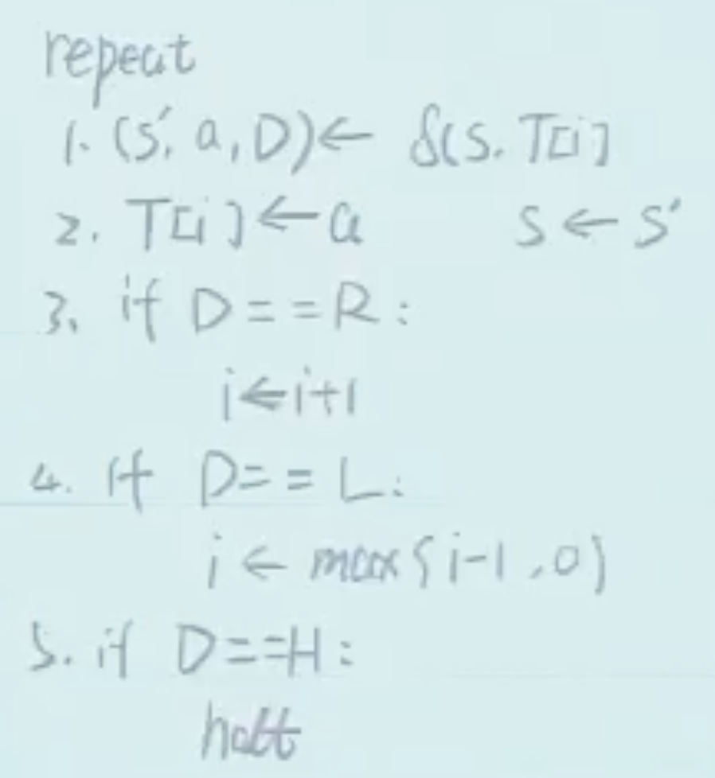

PDA 虽然拓展了 DFA/NFA 的表达能力，但其能力还是有限，例如无法表达 $\{0^n1^n0^n \mid n \geqslant 0\}$（通过 PDA 版本的 Pumping Theorem 证明，没有细讲）。一个更强大的模型是 **图灵机（Turing Machine）**。

## 图灵机

**图灵机（Turing Machine, TM）**：$M = (K, \Sigma, s, \delta)$，其中

-   $K$、$s$ 同 DFA/PDA；
-   $\Sigma$：有限字母表，至少包含 $\{0,1,\triangleright,\sqcup\}$，其中 $\triangleright$ 为**左端标记**，$\sqcup$ 为**空白符**；
-   $\delta$：转移函数，$\delta: K \times \Sigma \to K \times \Sigma \times \{L, R, S, H\}$，其中
    -   $K$：当前状态
    -   $\Sigma$：当前读入的 symbol
    -   $K$：下一个状态
    -   $\Sigma$：写入的 symbol（覆盖当前格子）
    -   $\{L, R, S, H\}$：移动方向，L 表示左移一格，R 表示右移一格，S 表示不动，H 表示停机

**运算过程**：给定输入 $x=x_0x_1\cdots x_{n-1} \in \{0,1\}^*$，图灵机纸带初始内容为 $\triangleright x_0x_1\cdots x_{n-1}\sqcup\sqcup\sqcup\cdots$，读写头初始位置在 $\triangleright$ 上。



-   如果停机：输出 $M(x)$ 为纸带上从 $\triangleright$ 之后开始到第一个 $\sqcup$ 之前的内容；
-   如果不停机：$M(x)$ 记为 $\bot$。

A TM $M$ computes a function $f: \{0,1\}^* \to \{0,1\}^*$ if $\forall x \in \{0,1\}^*$, $M(x) = f(x)$.

所有能被图灵机计算的函数称为**可计算函数（computable function）**。

## NAND-TM

我们先考虑更简单的模型 **NAND-TM**。

**NAND-TM**（= NAND-CIRC + arrays + loops）：

1.  数据类型：
    -   **下标 $i$**：唯一的整数变量，表示下标；
    -   **Scalars**：布尔变量；
    -   **Arrays**：布尔数组，无限长度，所有数组共用相同的下标 $i$；
2.  输入 $X$ 和输出 $Y$ 都是数组
3.  程序**一定以 $\text{MODANDJUMP}(a,b)$ 指令结尾**，作用为修改 $i$ 并跳转到第一行：
    -   如果 $a=1$ 且 $b=1$，则 $i \leftarrow i + 1$；
    -   如果 $a=0$ 且 $b=1$，则 $i \leftarrow i - 1$；
    -   如果 $a=1$ 且 $b=0$，则 $i \leftarrow i$；
    -   如果 $a=0$ 且 $b=0$，则停机。
4.  除最后一行外，其他行均为 $z = \text{NAND}(x,y)$，其中 $x,y,z$ 可以是 scalars 或 array 的第 $i$ 个元素
5.  除 $X$ 外，所有变量初始值为 0

**如何区分 $\sqcup$ 和 0？**可以创建数组 $X\text{-nonblank}$，其中 $X\text{-nonblank}[i] = 1$ 则表示 $X[i] \neq \sqcup$，否则为 0。因此传入输入 $X$ 的时候还会同时传入 $X\text{-nonblank}$，输出同理。

::fold{title="**例子**：NAND-TM 实现 INC" info always expand}
**输入：**$X=x_0x_1\cdots x_{n-1}$，表示 $\sum_{i=0}^{n-1} x_i 2^i$。

**要求输出：**$Y=y_0y_1\cdots y_{n-1}y_n$，满足 $\sum_{i=0}^{n} y_i 2^i = \sum_{i=0}^{n-1} x_i 2^i + 1$。

定义辅助标量 carry（表示进位），started（表示是否开始计算）。

```
carry = IF(started, carry, ONE(started))
started = ONE(started)
Y[i] = XOR(X[i], carry)
carry = AND(X[i], carry)
Y-nonblank[i] = ONE(started)
MODANDJUMP(X-nonblank[i], X-nonblank[i])
```

上述 `IF`、`ONE`、`XOR`、`AND` 均可由 NAND 实现。
::

---

::fold{title="**定理**：NAND-TM 和图灵机等价" success always expand}
对于函数 $f: \{0,1\}^* \to \{0,1\}^*$，存在 NAND-TM 程序 $P$ 计算 $f$ 当且仅当存在图灵机 $M=(K, \Sigma, s, \delta)$ 计算 $f$。

:::fold{title="证明" expand}
**$P\Leftarrow M$：**

先考虑如何编码一个图灵机。

-   $K$ states $\to$ $\lceil\log|K|\rceil$ scalar variables;
-   $\Sigma$ tape symbols $\to$ $\lceil\log|\Sigma|\rceil$ arrays;（例如 $\Sigma=\{0,1,\triangleright,\sqcup\}$，至少需要 $\log_2 4 = 2$ 个数组去编码一整个 tape）
-   $\{L, R, S, H\}$ head movements $\to$ 2 extra scalar variables;
-   $\delta: \{0,1\}^{\lceil\log|K|\rceil + \lceil\log|\Sigma|\rceil} \to \{0,1\}^{\lceil\log|K|\rceil + \lceil\log|\Sigma|\rceil + 2}$ 是 **finite function**，可以用 NAND-CIRC 实现，记为 P-CIRC。

取出 P-CIRC 计算结果的最后两项（Head movements），传入给 `MODANDJUMP` 指令，从而完成 NAND-TM 的构造。

**$P\Rightarrow M$：**

（就是上面的过程反过来，这里讲得很粗略）

:::

::

## NAND-TM 语法糖

::fold{title="**GOTO** / **WHILE**" info expand}
原理：给定原始程序：

```
1. ?1 = NAND(?1, ?1)
2. ?2 = NAND(?2, ?2)
...
t. ?t = NAND(?t, ?t)
t+1. MODANDJUMP(?, ?)
```

将其行号用变量 `line` 代替：

```
IF line == 1:
    ?1 = NAND(?1, ?1)
    line = 2
IF line == 2:
    ?2 = NAND(?2, ?2)
    line = 3
...
IF line == t:
    ?t = NAND(?t, ?t)
    line = t+1
IF line == t+1:
    MODANDJUMP(?, ?)
```

只需要修改 `line` 的值，即可实现任意行号跳转，也即 **GOTO** 指令。

有了 GOTO，就可以实现 **WHILE** 循环。

::

::fold{title="**多 index**" info expand}
例如想访问下标 j 和 k，创建两个 one-hot array `indexJ` 和 `indexK`，其中 `indexJ[j] = 1`，`indexK[k] = 1`，其他位置均为 0。

再创建一个辅助数组 `AtZero`，只在 `AtZero[0] = 1`，其他位置均为 0。

每次要访问下标前，先用 WHILE 循环将 `i` 移动到 0：

```
WHILE (AtZero[i] != 1):
    修改 MODANDJUMP 的两个参数，使 i--
```

然后再用 WHILE 循环将 `i` 移动到 j 或 k：

```
WHILE (indexJ[i] != 1):
    修改 MODANDJUMP 的两个参数，使 i++
```

::

::fold{title="**多维数组**" info expand}
多维数组是 $\mathbb{N}^n$，是可数集，可以映射到一维数组，直接拿一维数组模拟即可。
::

## NAND-RAM 模型

提供：

1. Bounded integer variables;
2. Index array access;
3. +, -, \*, /, etc.

容易证明 NAND-RAM 和 NAND-TM 等价（只给了 sketch，没细讲），而前者就是现代计算机使用的 RAM 模型。

因此，**图灵机与现代计算机等价**。
