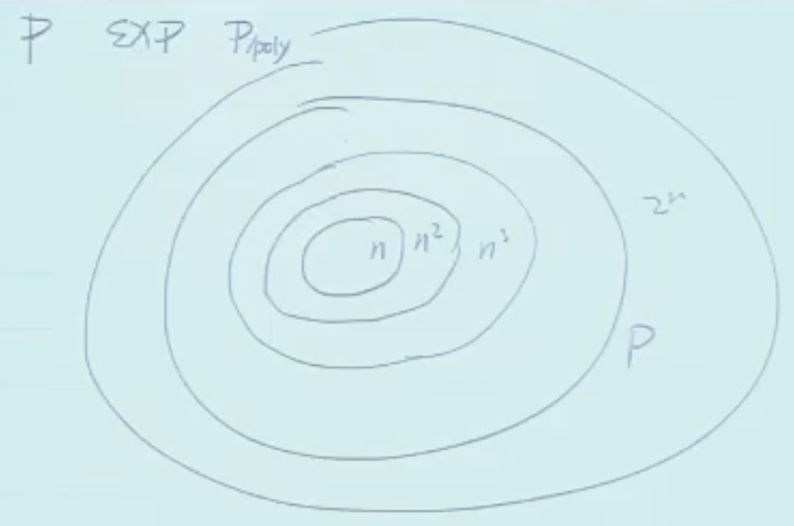

$\newcommand{\NN}{\mathbb{N}}$
$\newcommand{\rmSIZE}{\mathrm{SIZE}}$
$\newcommand{\rmTIME}{\mathrm{TIME}}$
$\newcommand{\rmRAM}{\mathrm{RAM}}$
$\newcommand{\rmTM}{\mathrm{TM}}$
$\newcommand{\rmHALT}{\mathrm{HALT}}$
$\newcommand{\Ppoly}{\mathcal{P}/\mathrm{poly}}$
$\newcommand{\zeroone}{\{0,1\}}$
$\newcommand{\zeroonestar}{\zeroone^*}$



由上节课的 Time Hierarchy Theorem 可知，函数的复杂类是分层的。但我们实际上很难给一个函数确定它属于哪个复杂类，甚至连判断是不是属于 $\mathcal{P}$ 都很困难。

::fold{title="3SAT problem" always expand}
Given a 3CNF formula $\varphi$, is $\varphi$ satisfiable?

:::fold{title="3CNF: Conjunctive Normal Form" info expand}
e.g. $\varphi = (x_0 \lor \bar x_1 \lor x_2) \land (\bar x_0 \lor x_1 \lor x_2) \land (x_0 \lor \bar x_1 \lor \bar x_2)$

-   Variables: $x_0, x_1, x_2$
-   Literals: $x_0, x_1, x_2, \bar x_0, \bar x_1, \bar x_2$
-   Clauses: $(x_0 \lor \bar x_1 \lor x_2)$, etc.

$\varphi$ is satisfiable if $\exists$ an assignment to variables such that $\varphi$ evaluates to true.
:::

3SAT 问题对应这样的布尔函数：

$$
\mathrm{3SAT}(\varphi) =
\begin{cases}
1 & \text{if } \varphi \text{ is satisfiable} \\
0 & \text{otherwise}
\end{cases}
$$

::

::fold{title="01EQ problem" always expand}
一系列线性方程，参数为 0 或 1，问是否存在 0-1 解。e.g.

$$
\begin{cases}
x_0 + x_1 + x_2 = 0\\
x_0 + x_1 = 1\\
x_1 + x_2 = 2
\end{cases}
$$

::

::fold{title="Subset Sum problem" always expand}
给定一组整数 $S = \{s_1, s_2, \ldots, s_n\}$ 和一个目标整数 $t$，问是否存在 $S$ 的一个子集 $S' \subseteq S$，使得 $\sum_{s_i \in S'} s_i = t$。（是否存在子集和为目标值）

e.g. $S = \{3, 34, 4, 12, 5, 2\}$，$t = 9$，则存在子集 $\{4, 5\}$ 使得 $4 + 5 = 9$。
::

上面的问题都没有已知的多项式时间算法，我们希望研究这类问题的难度，方法是**规约（reduction）**。

之前研究过规约，只不过是针对可计算性而言的，现在我们研究问题在计算时间上的难度，即**多项式时间规约（polynomial-time reduction）**。

---

**多项式时间规约**：Let $F, G: \zeroonestar \to \zeroone$, a polynomial-time reduction from $F$ to $G$ is a **polynomial-time** computable function $R: \zeroonestar \to \zeroonestar$ such that for every $x \in \zeroonestar$, $F(x) = G(R(x))$. 即**在多项式时间内**将 $F$ 的输入转化为 $G$ 的输入，使得 $F$ 的输出等于 $G$ 的输出。记作 $F \leq_p G$，$p$ 表示 polynomial-time。

::fold{title="**定理**：规约刻画难度" success always expand}
若 $F \leq_p G$ 且 $G \in \mathcal{P}$，则 $F \in \mathcal{P}$。

:::fold{title="证明" expand}
由规约性质，存在一个多项式时间可计算的函数 $R$。为了计算 $F(x)$，可以按照以下步骤进行：

$$
x \to R(x) \to G(R(x)) = F(x)
$$

1. 计算 $R(x)$，需要多项式时间 $\mathrm{poly}(|x|)$；
2. 计算 $G(R(x))$，由于 $G \in \mathcal{P}$，需要多项式时间 $\mathrm{poly}(|R(x)|)=\mathrm{poly}(\mathrm{poly}(|x|))=\mathrm{poly}(|x|)$。

因此，计算 $F(x)$ 需要的总时间为多项式时间，故 $F \in \mathcal{P}$。
:::
::

::fold{title="**定理**：规约的传递性" success always expand}
若 $F \leq_p G$ 且 $G \leq_p H$，则 $F \leq_p H$。

:::fold{title="证明" expand}
由假设，存在多项式时间可计算的函数 $R_1$（$F$ 到 $G$）、$R_2$（$G$ 到 $H$），定义 $R(x) = R_2(R_1(x))$，$R$ 就是从 $F$ 到 $H$ 的规约。
::

::fold{title="例子：3SAT $\leq_p$ 01EQ" info expand}
本质是要把 3SAT 的输入多项式时间内转化为 01EQ 的输入。

例如，3SAT 输入 $\varphi = (x_0 \lor x_1 \lor x_2) \land (x_1 \lor \bar x_2 \lor x_3)$，先转化为：

$$
\begin{cases}
x_0 + x_1 + x_2 \geq 1\\
x_1 + (1 - x_2) + x_3 \geq 1
\end{cases}
$$

有两个问题：其一，系数只能是 0 或 1，不能为负；其二，方程需要是等式。

为了解决第一个问题，引入辅助变量 $x_2'$，第二个方程转化成 $x_1 + x_2' + x_3 \geq 1$，并加上约束 $x_2 + x_2' = 1$。

为了解决第二个问题，添加松弛变量，将第一个方程改写为 $x_0 + x_1 + x_2 + y_1 + z_1 = 3$。由于 $y_1, z_1$ 都是 0-1 变量，因此该等式和之前的不等式等价。第二个方程同理。

**严谨证明流程：**

1. 详细说明 $R$ 的算法
2. 证明 $R$ 是多项式时间可计算的
3. 证明对于任意 $\varphi$，$\varphi$ 可满足 $\iff$ $R(\varphi)$ 有 0-1 解（需要证明两个方向）
   ::

::fold{title="例子：3SAT $\leq_p$ Subset Sum" info expand}
只需要证明 01EQ $\leq_p$ Subset Sum。思路：

$$
\begin{cases}
x_0 + x_1 + x_2 = 0\\
x_0 + x_1 = 1\\
x_1 + x_2 = 2
\end{cases}
\Longrightarrow
\begin{bmatrix}
1\\1\\0
\end{bmatrix} x_0 +
\begin{bmatrix}
1\\1\\1
\end{bmatrix} x_1 +
\begin{bmatrix}
1\\0\\1
\end{bmatrix} x_2 =
\begin{bmatrix}
0\\1\\2
\end{bmatrix}
$$

由于 $x_i$ 是 0-1 变量，因此可以看成是向量版的 Subset Sum 问题。接下来考虑如何将向量版 Subset Sum 转化为标量版 Subset Sum。

只需要把向量看成一个大整数的各个位即可，为了避免进位，可以直接采用 $B=2n=6$ 进制：

$$
(111)_6 x_0 + (111)_6 x_1 + (101)_6 x_2 = (012)_6
$$

然后再转化成十进制即可。
::

**多项式时间可验证**：$F: \zeroonestar \to \zeroone$ is polynomial-time verifiable if $\exists$ TM $V$ with polynomial running time such that for any $x \in \zeroonestar$, $F(x) = 1 \iff \exists t \in \zeroonestar$ such that $V(x, t) = 1$ and $|t| \leq \mathrm{poly}(|x|)$。即对于任意输入 $x$，如果 $F(x) = 1$，则存在一个多项式长度的**证据** $t$，使得验证器 $V$ 在输入 $(x, t)$ 上输出 1；反之亦然。

::fold{title="3SAT 是多项式时间可验证的" expand}
定义 $V(x, t)$：

```
if x is not 3CNF formula, or t is not an assignment to variables in x:
    return 0
evaluate x using t
if x evaluates to true:
    return 1
else:
    return 0
```

::

**定义 $\mathcal{NP}$**，所有多项式时间可验证的布尔函数的集合。

::fold{title="**定理**：$\mathcal{P}$、$\mathcal{NP}$、$\mathcal{EXP}$ 的包含关系" success always expand}
**$\mathcal{P} \subseteq \mathcal{NP} \subseteq \mathcal{EXP}$.**

:::fold{title="证明" expand}
**$\mathcal{P} \subseteq \mathcal{NP}$**：对于任意 $F \in \mathcal{P}$，存在 TM $M$ 在多项式时间内计算 $F$。定义验证器 $V(x, t)$：

```
run M on x
return M(x)
```

**$\mathcal{NP} \subseteq \mathcal{EXP}$**：对于任意 $F \in \mathcal{NP}$，我们已经有了多项式时间的验证器 $V$。为了计算 $F(x)$，可以枚举所有长度不超过 $\mathrm{poly}(|x|)$ 的证据 $t$ 即可：

```
for all string t with |t| <= |x|^a:
    run V(x, t)
    if V(x, t) == 1:
        return 1
return 0
```

这个算法的运行时间是指数级的，因此 $F \in \mathcal{EXP}$。
:::
::

目前为止无法证明 $\mathcal{P} \stackrel{?}{=} \mathcal{NP}$ 和 $\mathcal{NP} \stackrel{?}{=} \mathcal{EXP}$，但普遍认为两者都不成立。

::fold{title="**定理**：3SAT 和证明 $\mathcal{P}=\mathcal{NP}$ 一样难" success always expand}
**3SAT $\in \mathcal{P}$ if and only if $\mathcal{P} = \mathcal{NP}$.**
::

**NP-complete**：A function $G: \zeroonestar \to \zeroonestar$ is NP-complete if (1) $G \in \mathcal{NP}$; (2) $\forall F \in \mathcal{NP}, F \leq_p G$.（即 $G$ 属于 $\mathcal{NP}$，且比 $\mathcal{NP}$ 中的所有函数都难）

**NP-hard**：不要求 $G \in \mathcal{NP}$，只要求 (2) 成立。（直观上 NP-hard 比 NP-complete 更难）

::fold{title="**定理**：NP-complete 问题是最难的 $\mathcal{NP}$ 问题" success always expand}
**Let $G$ be an NP-complete function. If $G \in \mathcal{P}$, then $\mathcal{P} = \mathcal{NP}$.**
::

::fold{title="**定理**：Cook-Levin 定理" success always expand}
**3SAT is NP-complete.**
::

讲到这里下课了，上面几个定理下节课会证明。
