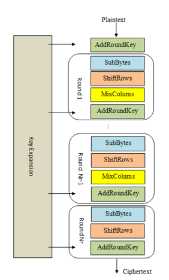
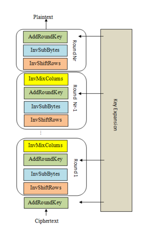

## 算法流程

**AES**（Advanced Encryption Standard）是一种**块加密算法**（Block Cipher）. 算法首先对明文进行分组，分组长度固定为 128 位（即 16 字节），密钥长度可选 128、192 或 256 位. 对于每一个 16 字节的明文块，进行如下步骤（以 AES-128 为例）：

::grid
:sep{span=12}

:sep{span=12}

::

1. **密钥扩展 KeyExpansion**：从 128 位密钥生成 11 个 128 位轮密钥.
2. **轮密钥加 AddRoundKey**：将明文与第 0 轮密钥异或.
3. **轮**：共 10 轮，前 9 轮为主轮，最后一轮（最终轮）不包含 MixColumns 步骤.
   1. **字节替换 SubBytes**：使用 S-box 替换字节.
   2. **行移位 ShiftRows**：对每行进行循环移位.
   3. **列混淆 MixColumns**：对每列进行线性变换.（在最终轮被跳过）
   4. **轮密钥加 AddRoundKey**：将轮密钥与状态矩阵异或.

## 分块加密模式

得到每一块密文后，为确保不同块之间互相影响，通常使用如下分块加密模式：

{.inv}

{.inv}

{.inv}

{.inv}

{.inv}

## 填充模式

由于 AES 要求明文长度必须是 16 字节的整数倍，因此需要对明文进行填充. 常见的填充模式见 [Using Padding in Encryption](https://www.di-mgt.com.au/cryptopad.html).

## 攻击

目前唯一对 AES 有效的攻击是**侧信道攻击**. 对于设计不良的实现，例如如果未能保证不同密钥的加密复杂度相同，攻击者可以通过测量加密时间、机器功耗等信息，进而推断密钥.

因此，在 CTF 中，对 AES 的攻击主要集中在**填充模式**和**分块加密模式**上.
