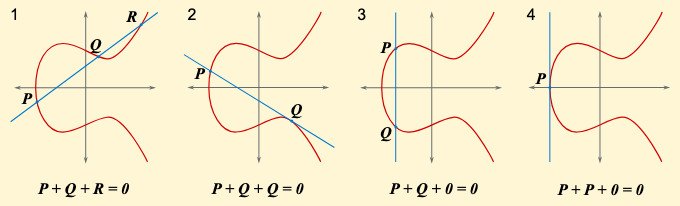

**椭圆曲线加密**（Elliptic Curve Cryptography，ECC）是一种基于**椭圆曲线**的公钥加密算法. 与 RSA 相比，具有更高的安全性和更小的密钥长度. ECC 的安全性基于椭圆曲线**离散对数问题**（ECDLP）. 目前椭圆曲线常采用的有限域有：

 - 以素数为模的有限域 $\mathrm{GF}(p)$.
 - 以 $2$ 的幂次为模的有限域 $\mathrm{GF}(2^m)$，常用于硬件实现.

---

## 椭圆曲线

椭圆曲线不是椭圆，而是满足如下方程的曲线：

$$
y^2 + axy + by = x^3 + cx^2 + dx + e
$$

并非所有曲线都适于加密，我们通常使用 **Weierstrass 形式**的椭圆曲线：

$$
\boxed{y^2 = x^3 + ax + b\text{，其中}\ 4a^3 + 27b^2 \neq 0}
$$

我们进一步在椭圆曲线上定义加法和标量乘法，使得曲线上的点集构成一个**Abel 群**.

设 $P$、$Q$ 是椭圆曲线上的两点，则 $R = P + Q$ 可以直观理解为：过 $P$、$Q$ 作一条直线，与曲线相交于第三点 $R'$，将 $R'$ 关于 $x$ 轴对称得到 $R$.

若 $P = Q$，则作曲线的切线；若连线无第三个交点，则定义 $P$、$Q$ 交于**无穷远点 $\mathcal{O}$**. 此处 $\mathcal{O}$ 即为椭圆曲线上的**单位元**.

椭圆曲线上的**标量乘法**则定义为点的累加. 可以验证以上定义满足 Abel 群的性质.



在实际应用中，我们将椭圆曲线的参数和点的坐标限制在有限域 $\mathbb{F}_p$ 上，得到如下形式的离散点集：

$$
E(\mathbb{F}_p) = \{(x, y) \in \mathbb{F}_p^2 \mid y^2=x^3+ax+b\text{，其中}\ 4a^3+27b^2\neq0\} \cup \{\mathcal{O}\}
$$

::note{info}
离散情况下的可视化动画：[The Animated Elliptic Curve - Visualizing Elliptic Curve Cryptography](https://curves.xargs.org/)
::

椭圆曲线上的标量乘法是一个**陷门函数**，如果将椭圆曲线加法和整数乘法对应，那么椭圆曲线乘法就是乘方运算，进而构成了**离散对数问题**，离散对数问题的一般性质在此处也适用.

---

## ECDH 密钥交换

**ECDH**（Elliptic Curve Diffie–Hellman）即椭圆曲线上的 [**DH 密钥交换算法**](./diffie-hellman)，其过程如下：

1. **初始化**：选择一条**椭圆曲线** $E$ 和一个**阶为素数**的**生成元** $G$，并公开这些参数. 现实中通常使用预先定义的椭圆曲线参数，如 NIST 的 [P-256 曲线](https://neuromancer.sk/std/nist/P-256).
2. **生成密钥**：
    - Alice 选择一个随机整数 $n_A$ 作为私钥，计算公钥 $Q_A = n_AG$.
    - Bob 选择一个随机整数 $n_B$ 作为私钥，计算公钥 $Q_B = n_BG$.
3. **交换公钥**：Alice 将 $Q_A$ 发送给 Bob，Bob 将 $Q_B$ 发送给 Alice.
4. **计算密钥**：Alice 计算 $S = n_AQ_B$，Bob 计算 $S = n_BQ_A$. 得到相同的值 $S = n_An_B \cdot G$ 用于后续通信.

当 $x$ 给定时，$y$ 最多只可能有两个值，并且无论使用哪个值，最后 $S$ 的横坐标都是相同的，因此交换公钥时只需传输 $x$ 坐标即可.

---

## ECDSA 数字签名

**椭圆曲线数字签名算法**（Elliptic Curve Digital Signature Algorithm，ECDSA）是基于椭圆曲线的 **DSA 数字签名**算法.

---

### 签名算法

假设 Alice 想要对消息 $m$ 进行签名，签名过程如下：

1. **初始化**：
    - 选择一条**椭圆曲线** $E$ 和一个**阶为素数**的**生成元** $G$，并公开这些参数.
    - Alice 选择区间 $[1, n-1]$ 的随机整数 $d_A$ 作为私钥，计算公钥 $Q_A = d_A\times G$. 其中 $n$ 是生成元 $G$ 的阶.
2. 计算消息的**哈希值** $e = H(m)$，其中 $H$ 是哈希函数.
3. 选择一个随机整数 $k \in [1, n-1]$，计算椭圆曲线上的点 $(x_1, y_1) = k \times G$.
4. 计算 $r = x_1 \bmod n$，若 $r = 0$ 则返回第 3 步.
5. 计算 $s = k^{-1}(e + rd_A) \bmod n$，若 $s = 0$ 则返回第 3 步.
6. 得到签名 $(r, s)$.

不同签名必须使用**不同的 $k$ 值**，否则可通过第 5 步的 $s$ 值推导出私钥 $d_A$.

---

### 验证算法

Bob 收到 Alice 的消息 $m$ 和签名 $(r, s)$，同时已知她的公钥 $Q_A$，验证签名的过程如下：

1. 验证 $Q_A$ 在椭圆曲线上，并且 $Q_A \neq \mathcal{O}$，$n\times Q_A = \mathcal{O}$.
2. 验证 $r$ 和 $s$ 是否在区间 $[1, n-1]$ 内.
3. 计算消息的哈希值 $e = H(m)$.
4. 计算 $u_1 = e\cdot s^{-1} \bmod n$ 和 $u_2 = r\cdot s^{-1} \bmod n$.
5. 计算点 $P = u_1 \times G + u_2 \times Q_A$ 并取其横坐标 $x_P$. 验证 $x_P \neq \mathcal{O}$.
6. 验证 $x_P \equiv r \pmod n$.

---

## 攻击途径

对于 $\mathbb{F}_p$ 上的 ECDLP 问题 $Q = n \times G$：

**MOV 攻击**：当 $G$ 的 Embedding Degree 较小（$\leqslant 6$）时，可通过该攻击求解.

 - **Embedding Degree**：满足 $p^k \equiv 1 \pmod N$ 的最小正整数 $k$. 其中 $N = \operatorname{ord}(G)$.
 - [SageMath 实现](https://github.com/jvdsn/crypto-attacks/blob/master/attacks/ecc/mov_attack.py)、[论文](https://fse.studenttheses.ub.rug.nl/22732/1/bMATH_2020_SmitR.pdf)、[StackExchange 上的简介](https://crypto.stackexchange.com/a/1875).

---

## 例题

### CryptoHack - Moving Problems

::fold{expand info title="题目大意"}
给出 Weierstrass 形式的椭圆曲线 $E(\mathbb{F}_p)$ 的参数如下：

```python
p = 1331169830894825846283645180581
a = -35
b = 98
E = EllipticCurve(GF(p), [a, b])
G = E(479691812266187139164535778017,
      568535594075310466177352868412)
```

Alice 和 Bob 通过该椭圆曲线进行 ECDH 密钥交换，你截获两人的公钥如下：

```python
A = E(1110072782478160369250829345256,
      800079550745409318906383650948)
B = E(1290982289093010194550717223760,
     762857612860564354370535420319)
```

求公共密钥 $S$ 的横坐标.
::

此题密钥交换过程天衣无缝，所以问题只可能出现在曲线参数的选择上. 首先对 $G$ 的阶进行分解：

```python
print(factor(G.order()))
# 2 * 7 * 271 * 23687 * 1153763334005213
```

最后一项 $1153763334005213$ 非常大，因此不能用朴素 Pohlig-Hellman 算法求解（可以用 PH 来缩减问题规模，但对于本题没必要）. 注意到参数 $a$ 和 $b$ 都很小，尝试计算 Embedding Degree：

```python
MAX_K = 6
N = G.order()
for k in range(1, MAX_K + 1):
    if p ** k % N == 1:
        print(k)  # 2
        break
```

Embedding Degree 为 $2$，因此可以通过 MOV 攻击求解.

---

## 相关资源

 - [**Standard curve database**](https://neuromancer.sk/std/)
 - [**Python ecdsa 库**](https://pypi.org/project/ecdsa/)：
    ```python
    from ecdsa.ecdsa import Public_key, Private_key, generator_192
    from random import randrange

    G = generator_192
    n = G.order()
    secret = randrange(1, n)
    pubkey = Public_key(G, G * secret)
    privkey = Private_key(pubkey, secret)

    m = ...
    sig = privkey.sign(m, randrange(1, n))

    assert pubkey.verifies(m, sig)
    ```
 - [**SageMath**](https://doc.sagemath.org/html/en/reference/arithmetic_curves/sage/schemes/elliptic_curves/constructor.html)：
    ```python
    from sage.all import *

    p = ...
    K = GF(p)
    a = K(...)
    b = K(...)
    E = EllipticCurve(K, [a, b])
    G = E.gens()[0]
    ```
